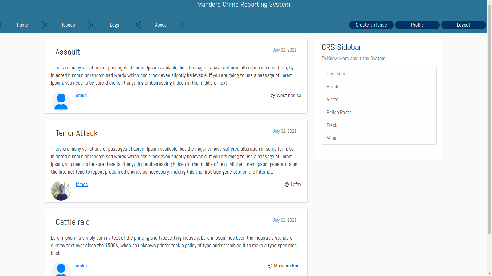
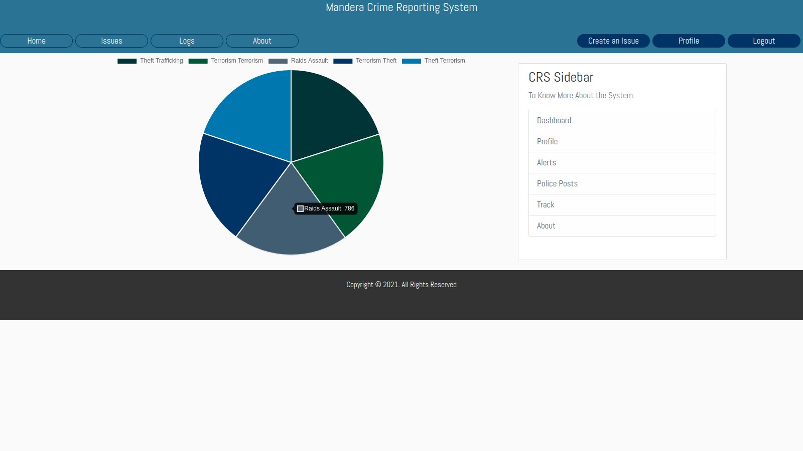
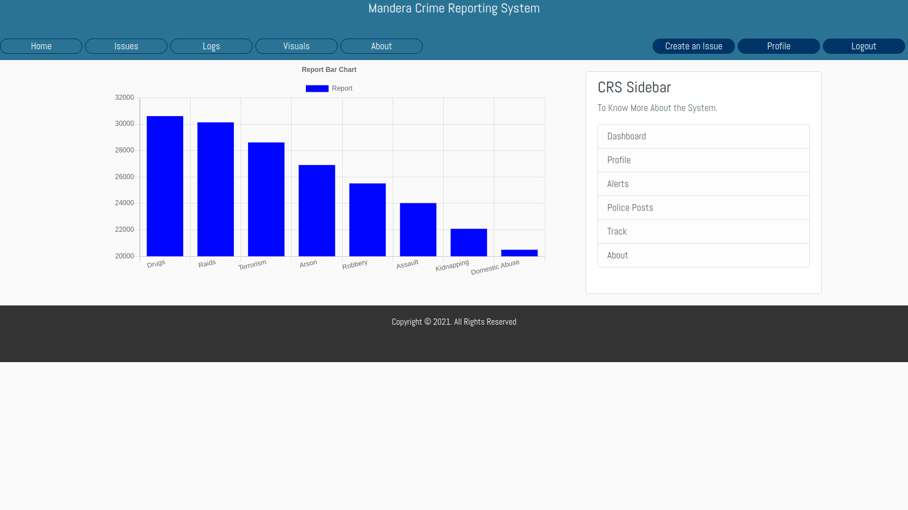

# Crime Management System

A web portal where victims can log in and submit their complaints anonymously

## Built with
* [django](https://www.djangoproject.com/download/) - The web-backend framework used
* [Bootstrap4](https://pypi.org/project/django-bootstrap4/) - Elegant look
* [PostgreSQL](https://www.postgresql.org/docs/) Relational Database Used
* [AWS](https://aws.amazon.com/) For serving the Images

To install the project follow these steps:

1. `git clone https://github.com/OkothPius/CRS.git`
1. `$ cd CRS`
1. `$ sudo apt install python3-pip python3-django`
1. `$ sudo apt install python3 venv`
1. `$ python3.8 -m venv my_env`
1. `$ source my_env/bin/activate` (for Linux/Mac OS )
1. `$ pip install -r requirements.txt`
1. `$ python manage.py migrate`
1. `$ python manage.py runserver`

## License

This project is licensed under the MIT License - see the [LICENSE.md](LICENSE.md) file for details

## Acknowledgments
* Inspiration
* Still in development
